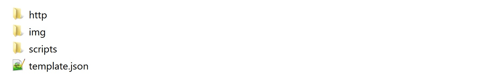

# devopsplayground4-packer

## Creating machine and container images for multiple platforms from a single source configuration

### Pre-requisites

#### Installing Packer


- Create a folder named  `packer` in your PC

- Put all the files from folder `Template Virtualbox` inside the newly created folder in our computer.

- Install packer, you can download and check the instructions from [here](https://www.packer.io/intro/getting-started/setup.html).

- Download and install Virtualbox from [here](https://www.virtualbox.org/wiki/Downloads).

The structure of the packer folder should be the following

**Note:** The following image represents windows OS



## Using Packer


1. Under the command window navigate to the packer folder
- While inside the folder in the command window type:
 1. Linux/Mac/Git Bash `./packer`
 - Windows `packer`

Make sure the following comes up to know that Packer is working.

```
   usage: packer [--version] [--help] <command> [<args>]

   Available commands are:
       build       build image(s) from template
       fix         fixes templates from old versions of packer
       inspect     see components of a template
       push        push a template and supporting files to a Packer build service
       validate    check that a template is valid
       version     Prints the Packer version
```
## Working with packer commands  
**Note:** The following commands to call Packer works on windows, please make sure you are using the one that corresponds to your OS

### First lets make sure that the template is working properly

Run the following command under the console window

`packer validate template.json`

The output should be:

`Template validated successfully.`

### Now lets inspect our template

In our command windows lets run:

`packer inspect template.json`

Packer will show us the structure of our files

```
Optional variables and their defaults:

  CHECKSUM      = ad4e8c27c561ad8248d5ebc1d36eb172f884057bfeb2c22ead823f59fa8c3dff
  CHECKSUM_TYPE = sha256
  CPUS          = 1
  DISK_SIZE     = 5120
  GUEST_IP      = 10.0.2.15
  GUEST_PORT    = 80
  HOST_IP       = 127.0.0.1
  HOST_PORT     = 8080
  ISO_URL       = debian-8.5.0-amd64-netinst.iso
  MEMORY        = 512
  NAME          = World
  OS_TYPE       = Debian_64
  PASS          = forest
  PROTOCOL      = tcp
  USER          = forest

Builders:

  virtualbox-iso

Provisioners:

  file
  shell
  shell

Note: If your build names contain user variables or template
functions such as 'timestamp', these are processed at build time,
and therefore only show in their raw form here.
```

### Working with user variables

User variables can be defined inside the template in the `variables` section with the following format:

```
"variables": {
   "aws_access_key": "",
   "aws_secret_key": ""
 },
```

This is how we have our variables currently set up in our template.

### Packer has two other methods for setting variables

#### 1) From a file

Variables can also be set from an external JSON file. The  `-var-file` flag reads a file.

**Note:** JSON files can be opened with any text editors.

We are going to create another file called `config.json` in the packer folder and we are going to put the variable list from our `template.json` (remember to delete the variables from `template.json`)

`config.json` should look like this:

```
{
  "USER": "forest",
  "PASS": "forest",
  "OS_TYPE": "Debian_64",
  "MEMORY": "512",
  "CPUS": "1",
  "DISK_SIZE": "5120",
  "NAME": "World",
  "PROTOCOL": "tcp",
  "HOST_IP": "127.0.0.1",
  "HOST_PORT": "8080",
  "GUEST_IP": "10.0.2.15",
  "GUEST_PORT": "80",
  "ISO_URL": "debian-8.5.0-amd64-netinst.iso",
  "CHECKSUM": "ad4e8c27c561ad8248d5ebc1d36eb172f884057bfeb2c22ead823f59fa8c3dff",
  "CHECKSUM_TYPE": "sha256"
}
```

Let's try to validate `template.json` and see what happens.

Now it is not recognizing the variables. In order to pass them to the template we need to use the `-var-file` tag.

`Packer validate -var-file=config.json template.json`

#### 2) From The Command Line

To set variables from the command line, the `-var` flag is used as a parameter to `packer build`

## Building the template

Finally with all the information given we can build our template by passing the variables located under the `config.json` file and we are also going to modify one of the values using the `-var` flag

We want to change the value of the variable that is given under the shell command. The variable being used is `NAME`. By default it has the value `World` so we are going to change it to our name.

The command should look like this:

`packer build -var-file=config.json -var 'NAME=XXXXX' template.json`

Another way to put it would be:  
**Note:** For windows use `^` (caret) instead of `\`

```
$ packer build \
    -var-file=config.json \
    -var 'NAME=XXXXX' \
    template.json
```

After pressing Enter VirtualBox will begin creating the VM and running it in headless mode. Please be careful not to open up a window with the running machine since interaction with it may cause a conflict while generating the image.


## Creating an instance from our new image

Once our build has finished we will get the following under our command window:

```
==> virtualbox-iso: Unregistering and deleting virtual machine...
Build 'virtualbox-iso' finished.

==> Builds finished. The artifacts of successful builds are:
--> virtualbox-iso: VM files in directory: MY_VM_XXXXXXXXXXXXX
```

Under the folder  were we have our `template.json` a new folder will be created with the name `MY_VM_XXXXXXXXXXXXX`

Inside this folder you should have now 2 files:
- OVF: This file contains the configuration of our virtual machine.
- VMDK: This file contains our actual virtual machine with the OS

To launch our newly created image we need to open `VirtualBox` and the go to:

File -> Import (and we look for our new OVF file)

Once the VM has been imported we need to run it.

### Taking a look in our new VM

Once our VM is running we can open any browser of choice and type in the URL:

`localhost:8080`

We should be able to see that apache is working. Afterwards we can type:

`localhost:8080/forest.html`

This will show the webpage we created with one of our scripts.


## PARALLEL BUILDS

Now that we have our template to create a VM under VirtualBox we can use the same configuration to do it under other tools in parallel. Here's an example of the syntax to add VMware to our build.

```
"builders": [{
    "type": "virtualbox-iso",
    ...
    ...
    "vboxmanage": [
      [ "modifyvm", "{{.Name}}", "--memory", "512" ],
      [ "modifyvm", "{{.Name}}", "--cpus", "1" ]
    ]
  },{
    "type": "vmware-iso",
    ...
    ...
    "vmx_data": {
      "memsize": "512",
      "numvcpus": "1",
    }
  }],
```

```
"provisioners": [
  {
    "type": "shell",
    "execute_command": "echo 'password'|sudo -S sh '{{.Path}}'",
    "override": {
      "virtualbox-iso": {
        "scripts": [
          ...
          ...
        ]
      },
      "vmware-iso": {
        "scripts": [
          ...
          ...
        ]
      }
    }
  }
],
```
